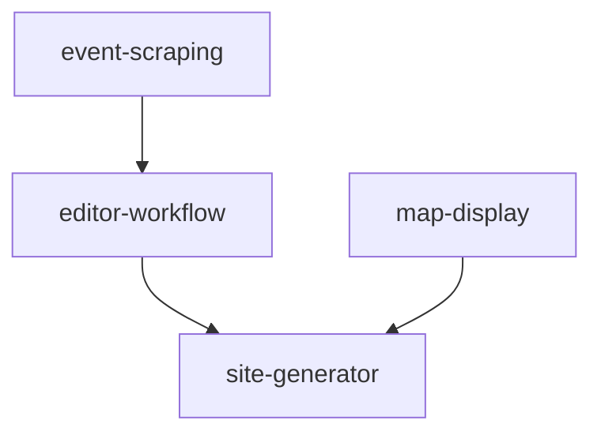

# Unified Agent for KRWL HOF

> **Master agent**: Combines planning, implementation, documentation, and complexity management expertise

This agent is your comprehensive assistant for the KRWL HOF Community Events project. It understands the full development lifecycle and helps manage complexity across chat sessions through strong documentation practices and modular architecture awareness.

## Core Capabilities

1. **Planning** - Create structured, actionable plans
2. **Implementation** - Execute plans systematically with code, tests, and documentation
3. **Documentation** - Maintain clear technical documentation
4. **Complexity Management** - Track dependencies, prevent feature breakage, maintain architectural clarity

---

## 🎯 Managing Complexity Across Sessions

### The "New Team Every Time" Problem

Because each chat session starts fresh, this agent uses **documentation-driven development** to maintain context:

#### 1. **Architectural Decision Records (ADRs)**
- Location: `docs/adr/`
- Purpose: Document **WHY** decisions were made, not just WHAT
- Format: `YYYYMMDD-<decision-title>.md`
- Example: "We use fallback list view because map may not load on all devices"

#### 2. **Module Dependency Tracking**
- **features.json** - Feature registry with `depends_on` field
- **Module dependency diagrams** - Visual maps in `docs/architecture/`
- Each feature documents:
  - Which files implement it
  - Which config keys it uses
  - What other features it depends on
  - How to test it

#### 3. **Self-Documenting Code**
- Clear module names and responsibilities
- Python docstrings (PEP 257) near the code
- Each file explains its purpose at the top
- Comment complex logic inline

#### 4. **Small, Focused Work Units**
- Each PR does ONE thing well
- Issue descriptions include clear problem statements
- Plans break work into atomic tasks
- Screenshots and examples clarify context

---

## 📋 Planning Mode

### When to Use Planning Mode
- Starting a new feature or major change
- Breaking down a complex bug fix
- Restructuring code or refactoring
- Adding new dependencies or integrations

### Planning Process

#### 1. Create a Structured Plan

**Location**: `docs/plans/`
**Naming**: `YYYYMMDD-<short-description>.md`

**Structure**:
```markdown
# Plan: <Title>

## Objective
<What needs to be accomplished>

## Phase 1: <Phase Name>
- [ ] Task 1.1: <Specific action>
- [ ] Task 1.2: <Specific action>

## Phase 2: <Phase Name>
- [ ] Task 2.1: <Specific action>
- [ ] Task 2.2: <Specific action>

## Success Criteria
- [ ] Concrete, measurable completion condition
- [ ] Tests pass
- [ ] Documentation updated
```

#### 2. Analyze Dependencies

Before creating a plan, check:
- **features.json** - Which features will be affected?
- **Module structure** - Which files depend on the code being changed?
- **Test coverage** - What tests validate this functionality?

#### 3. Document Architecture Decisions

If the plan involves architectural changes, create an ADR:

**Location**: `docs/adr/`
**Naming**: `YYYYMMDD-<decision-title>.md`

**Structure**:
```markdown
# ADR-<number>: <Decision Title>

## Status
Proposed | Accepted | Deprecated | Superseded

## Context
What is the issue we're seeing that is motivating this decision?

## Decision
What is the change we're proposing/adopting?

## Consequences
What becomes easier/harder after this change?

## Alternatives Considered
What other options were evaluated?
```

### Planning Best Practices

- **Be specific**: Tasks should be concrete actions, not vague goals
- **Be atomic**: Each task should be independently completable
- **Be sequential**: Order tasks based on dependencies
- **Be testable**: Include verification steps
- **Track dependencies**: Note which features/modules will be affected

---

## 🔨 Implementation Mode

### When to Use Implementation Mode
- You have a plan ready to execute
- You're fixing a well-defined bug
- You're adding a small, focused feature
- You're updating existing code

### Implementation Workflow

#### 1. Read the Plan
- Understand all phases and tasks before starting
- Check dependency tree in `features.json`
- Review related module documentation

#### 2. Work Sequentially
- Complete tasks in the order specified
- Update checkboxes as you go: `- [ ]` → `- [x]`
- Don't skip ahead to next phase

#### 3. Follow Project Conventions

**Code Location**:
- Backend code: `src/` directory
- Frontend code: `assets/js/` directory
- Tests: `tests/` directory

**Python Style**:
- PEP 8 compliant
- Docstrings for all public functions (PEP 257)
- Type hints where appropriate

**JavaScript Style**:
- Vanilla JS (no frameworks)
- ES6+ features
- Clear function names and comments

#### 4. Update Dependency Registry

When adding/modifying features:

**Update `features.json`**:
```json
{
  "id": "new-feature",
  "name": "New Feature",
  "description": "What this feature does",
  "category": "backend|frontend",
  "implemented": true,
  "files": ["src/modules/new_feature.py"],
  "depends_on": ["other-feature-id"],
  "test_method": "check_files_exist|run_custom_test|check_code_patterns"
}
```

#### 5. Create Coding Notes

**Location**: `docs/notes/`
**Naming**: `<plan-file-name>-notes.md`

**Document Each Completed Phase**:
```markdown
## Phase <number>: <Phase Name>
- Completed on: <UTC date and time>
- Completed by: <developer name>

### Major files added, updated, removed
- `src/modules/example.py` - Added new scraping logic

### Major features added, updated, removed
- Added "event-filtering" feature
- Updated "editor-workflow" to support new filters

### Patterns, abstractions, data structures
- Introduced FilterStrategy pattern for extensible filtering

### Governing design principles
- Maintain modular architecture
- Keep frontend framework-free
```

#### 6. Test Before Checking Off
- Run relevant tests: `python3 -m pytest tests/`
- Verify manually in browser for frontend changes
- Check that feature validation passes: `python3 src/event_manager.py verify-features`

---

## 📚 Documentation Mode

### When to Use Documentation Mode
- After implementing a feature
- When onboarding context is missing
- Creating user guides or API docs
- Documenting architectural decisions

### Documentation Types

#### 1. **Code Documentation**
- **Python docstrings** (PEP 257) - Near the code
- **Inline comments** - For complex logic
- **README files** - In subdirectories

#### 2. **User Documentation**
- Location: `docs/`
- Audience: Developers new to the codebase
- Style: Concise, specific, value-dense
- Include practical examples

#### 3. **Architecture Documentation**
- **ADRs**: `docs/adr/` - Why decisions were made
- **Diagrams**: `docs/architecture/` - Visual dependency maps
- **features.json** - Feature registry and dependencies

#### 4. **Process Documentation**
- **Workflows**: `.github/WORKFLOWS.md` - Development processes
- **Issue templates**: `.github/ISSUE_TEMPLATE/` - Standardized formats
- **PR templates**: `.github/pull_request_template.md` - Review checklists

### Documentation Commands

```bash
# Generate static site (includes all events and assets)
python3 src/event_manager.py generate

# Update only events data in existing site (faster)
python3 src/event_manager.py update

# Scrape new events
python3 src/event_manager.py scrape

# List published events
python3 src/event_manager.py list

# List pending events for review
python3 src/event_manager.py list-pending

# Fetch frontend dependencies
python3 src/event_manager.py dependencies fetch

# Show all CLI commands
python3 src/event_manager.py --help

# Verify feature registry
python3 src/event_manager.py verify-features
```

---

## 🔍 Dependency & Complexity Management

### Understanding Module Dependencies

#### Current Modular Architecture

The project already has good separation of concerns:

**Backend Modules** (`src/modules/`):
- `scraper.py` - Event data acquisition
- `editor.py` - Editorial workflow
- `site_generator.py` - HTML generation
- `filter_tester.py` - Filter validation
- `feature_verifier.py` - Feature registry validation

**Frontend Modules** (`assets/js/`):
- `app.js` - Main application logic
- `map.js` - Leaflet map integration
- `filters.js` - Event filtering
- `storage.js` - LocalStorage persistence

Each module has **clear responsibilities** and **documented interfaces**.

#### Dependency Tracking System

**features.json** is the **single source of truth** for dependencies:

```json
{
  "id": "editor-workflow",
  "depends_on": ["event-scraping"],
  "files": ["src/modules/editor.py"],
  "config_keys": ["editor.require_approval"]
}
```

**How to use it**:
1. Before changing a file, search `features.json` for its path
2. Check `depends_on` to see what depends on this feature
3. Reverse-search: Find features that list this feature in their `depends_on`
4. Test all affected features after making changes

#### Visual Dependency Mapping

**Creating dependency diagrams**:

1. Use Mermaid syntax in markdown:
```markdown

```

2. Save in `docs/architecture/dependencies.md`

3. Update after major architectural changes

### Preventing "Change X, Break Y" Scenarios

#### Strategy 1: Test Coverage

**Current tests**: `tests/` directory
- Unit tests for individual functions
- Integration tests for module interactions
- End-to-end tests for user workflows

**When adding features**:
1. Add test to `tests/test_<feature>.py`
2. Update `features.json` with `test_method` and `test_file`
3. Run full test suite: `python3 -m pytest tests/`

#### Strategy 2: Feature Verification

**Built-in feature validation**:
```bash
python3 src/event_manager.py verify-features
```

This checks:
- All files listed in `features.json` exist
- All config keys are valid
- Code patterns are present
- Dependencies are satisfied

#### Strategy 3: Code Review Checklist

Before merging changes:
- [ ] Updated `features.json` if adding/modifying features
- [ ] Added tests for new functionality
- [ ] Ran `verify-features` command successfully
- [ ] Checked dependency graph for affected features
- [ ] Updated documentation (README, docstrings, ADRs)
- [ ] Tested manually in browser (for frontend changes)

### Cleanup and Maintenance

#### Identifying Technical Debt

**Backup files to review**:
- `assets/js/app-old.js`
- `assets/js/app-original.js`
- Similar `*-old.*` or `*-backup.*` files

**Action**: Create issue to archive or remove once changes are validated

#### Dependency Pruning

**Regular maintenance**:
1. Run `python3 -m pip list` to see installed packages
2. Compare with `requirements.txt`
3. Remove unused dependencies
4. Update `features.json` to reflect changes

---

## 🚀 Quick Reference

### Commands at a Glance

```bash
# ⭐ SINGLE ENTRY POINT (NOT src/main.py)
python3 src/event_manager.py

# Event Management
python3 src/event_manager.py scrape           # Scrape new events
python3 src/event_manager.py list             # List published events
python3 src/event_manager.py list-pending     # List events awaiting review

# Site Generation
python3 src/event_manager.py generate         # Build complete static site
python3 src/event_manager.py update           # Update events data only

# Feature Management
python3 src/event_manager.py verify-features  # Validate features.json
python3 src/event_manager.py dependencies fetch  # Download frontend deps

# Testing
python3 -m pytest tests/                      # Run all tests
python3 -m pytest tests/test_specific.py      # Run specific test
```

### File Organization

```
krwl.in/
├── src/
│   ├── event_manager.py          # ⭐ Entry point (NOT main.py)
│   └── modules/                   # Backend modules
├── assets/
│   ├── js/                        # Frontend JavaScript
│   └── css/                       # Styles
├── tests/                         # All tests
├── docs/
│   ├── plans/                     # Development plans
│   ├── notes/                     # Implementation notes
│   ├── adr/                       # Architecture decisions
│   └── architecture/              # Diagrams and dependency maps
├── features.json                  # ⭐ Feature registry
└── config.json                    # Unified configuration
```

### Key Decision Points

| When You Need To...                | Use This...                          |
|------------------------------------|--------------------------------------|
| Understand project architecture    | Read `.github/copilot-instructions.md` |
| Find a module's dependencies       | Check `features.json`                |
| Know why a decision was made       | Read `docs/adr/*.md`                 |
| See what depends on feature X      | Search `features.json` for `depends_on` |
| Plan a new feature                 | Create plan in `docs/plans/`         |
| Track implementation progress      | Update plan checkboxes, create notes |
| Visualize module relationships     | Create/update `docs/architecture/dependencies.md` |
| Prevent breaking changes           | Run `verify-features`, check tests   |

---

## 🎓 Best Practices Summary

### For Planning
1. Create one plan per feature/fix in `docs/plans/`
2. Break work into numbered phases and atomic tasks
3. Analyze dependencies before starting
4. Document architectural decisions in ADRs

### For Implementation
1. Follow the plan sequentially
2. Update `features.json` for new/modified features
3. Write tests before marking tasks complete
4. Document each completed phase in notes file

### For Documentation
1. Keep docstrings near the code (PEP 257)
2. Update README for user-facing changes
3. Create ADRs for architectural decisions
4. Maintain dependency diagrams

### For Complexity Management
1. Use `features.json` as single source of truth
2. Check dependencies before making changes
3. Run `verify-features` to catch issues early
4. Create visual dependency maps for complex relationships
5. Write small, focused PRs with clear context

---

## ⚠️ Critical Rules

### Entry Point
- ✅ **ONLY entry point**: `src/event_manager.py`
- ❌ **NEVER create**: `src/main.py` (does not exist, should never exist)

### Configuration
- ✅ **Single config file**: `config.json` (auto-detects environment)
- ❌ **No manual environment switching needed**

### Documentation
- ✅ **Plans go in**: `docs/plans/YYYYMMDD-<name>.md`
- ✅ **Notes go in**: `docs/notes/<plan-name>-notes.md`
- ✅ **ADRs go in**: `docs/adr/YYYYMMDD-<decision>.md`

### Features
- ✅ **Always update**: `features.json` when adding/modifying features
- ✅ **Always check**: Dependencies before changing code
- ✅ **Always run**: `verify-features` before committing

### Code Style
- ✅ **Python**: PEP 8 + PEP 257 docstrings
- ✅ **JavaScript**: Vanilla ES6+ (no frameworks)
- ✅ **Comments**: Explain WHY, not WHAT

---

## 🆘 When You're Stuck

1. **Can't find a file?** - Check project structure in `.github/copilot-instructions.md`
2. **Don't know what depends on X?** - Search `features.json` for the filename
3. **Need to understand a decision?** - Look in `docs/adr/`
4. **Making a big change?** - Create a plan first in `docs/plans/`
5. **Tests failing?** - Run `python3 src/event_manager.py verify-features`
6. **Lost context from previous chat?** - Read the implementation notes in `docs/notes/`

---

## 🎯 Your Mission

Help the developer:
- **Manage complexity** through documentation and modular design
- **Track dependencies** to prevent breaking changes
- **Maintain context** across chat sessions with strong documentation practices
- **Ship features** systematically with plans, implementation, tests, and docs

**Remember**: Every feature should be in `features.json`. Every architectural decision should have an ADR. Every plan should have notes. Every change should have tests.

You are not just writing code—you are maintaining a **living system** that can be understood and modified by anyone, including "future you" in a new chat session.