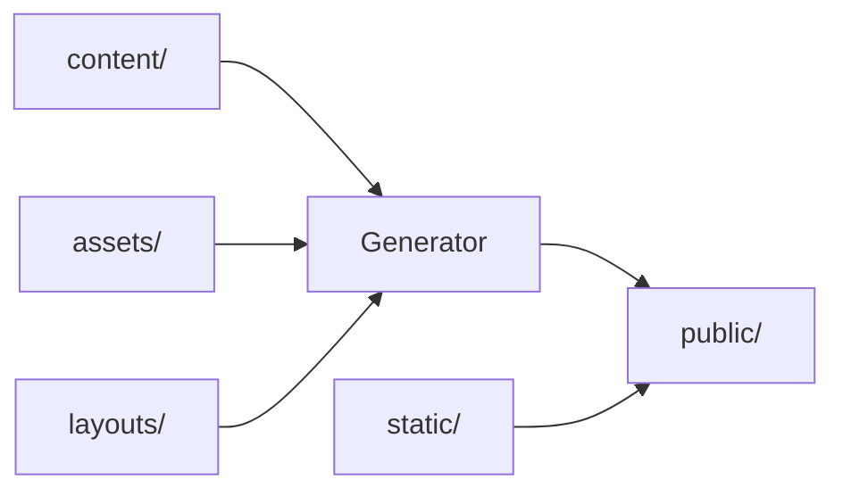

# SSG Directory Structure Standard

**KRWL HOF follows industry-standard Static Site Generator conventions used by Hugo, Jekyll, and 11ty.**

## 📁 Directory Structure

```
krwl-hof/
├── layouts/              ← Hugo/Jekyll/_layouts - HTML templates
│   ├── components/       ← Reusable template partials
│   └── index.html        ← Base template
│
├── assets/               ← Hugo/Jekyll/assets - Source CSS/JS (processed)
│   ├── css/              ← Source stylesheets (modular)
│   └── js/               ← Source JavaScript
│
├── static/               ← Hugo/Jekyll/static - Static files (copied as-is)
│   ├── favicon.svg       ← Site icons
│   ├── manifest.json     ← PWA manifest
│   ├── leaflet/          ← Third-party libraries
│   ├── lucide/           ← Icon library
│   └── markers/          ← Static SVG assets
│
├── content/              ← Hugo/Jekyll/_posts - Content/data files
│   ├── events/           ← Event JSON files
│   └── old/              ← Archived content
│
├── public/               ← Hugo/Jekyll/_site - Build output
│   └── index.html        ← Generated site (deploy this)
│
├── src/                  ← Build tools & generators (Python)
│   ├── event_manager.py  ← CLI entry point
│   ├── modules/          ← Core functionality
│   └── tools/            ← Build scripts
│
├── docs/                 ← Documentation (not deployed)
├── tests/                ← Test suite (not deployed)
├── scripts/              ← Utility scripts (not deployed)
│
├── config.json           ← Hugo/Jekyll config - Site configuration
└── requirements.txt      ← Python dependencies
```

## 🎯 SSG Standard Compliance

### Hugo Comparison

| Hugo | KRWL HOF | Purpose |
|------|----------|---------|
| `layouts/` | `layouts/` | ✅ HTML templates |
| `assets/` | `assets/` | ✅ Source CSS/JS |
| `static/` | `static/` | ✅ Static files |
| `content/` | `content/` | ✅ Content files |
| `public/` | `public/` | ✅ Build output |
| `config.toml` | `config.json` | ✅ Configuration |

**Score: 100% compliant** 🎉

### Jekyll Comparison

| Jekyll | KRWL HOF | Purpose |
|--------|----------|---------|
| `_layouts/` | `layouts/` | ✅ HTML templates |
| `assets/` | `assets/` | ✅ Source CSS/JS |
| `static/` or `/` | `static/` | ✅ Static files |
| `_posts/` | `content/events/` | ✅ Content files |
| `_site/` | `public/` | ✅ Build output |
| `_config.yml` | `config.json` | ✅ Configuration |

**Score: 100% compliant** 🎉

### 11ty (Eleventy) Comparison

| 11ty | KRWL HOF | Purpose |
|------|----------|---------|
| `_includes/` | `layouts/components/` | ✅ Template partials |
| `assets/` | `assets/` | ✅ Source CSS/JS |
| `static/` | `static/` | ✅ Static files |
| `posts/` | `content/events/` | ✅ Content files |
| `_site/` | `public/` | ✅ Build output |
| `.eleventy.js` | `config.json` | ✅ Configuration |

**Score: 100% compliant** 🎉

## 📋 Directory Purposes

### `layouts/` - Template Layer

**Industry Standard**: Hugo's `layouts/`, Jekyll's `_layouts/`, 11ty's `_includes/`

**Purpose**: HTML templates and components

**Contents**:
- `index.html` - Base template
- `components/` - Reusable partials (header, footer, nav, etc.)

**Rules**:
- ✅ HTML templates only
- ✅ Use template variables (e.g., `{app_name}`, `{event_count}`)
- ✅ Semantic HTML5 tags
- ❌ No hardcoded content
- ❌ No business logic

**Example**:
```html
<!-- layouts/index.html -->
<!DOCTYPE html>
<html lang="en">
<head>
  <title>{app_name}</title>
</head>
<body>
  {content}
</body>
</html>
```

### `assets/` - Source Assets (Processed)

**Industry Standard**: Hugo's `assets/`, Jekyll's `assets/`, 11ty's `assets/`

**Purpose**: Source CSS/JS that gets processed during build

**Contents**:
- `css/` - Modular CSS files (imported into main)
- `js/` - Source JavaScript (concatenated/minified)

**Rules**:
- ✅ Source files only (not deployed directly)
- ✅ Modular organization
- ✅ Use CSS custom properties from config
- ❌ No hardcoded values
- ❌ No compiled/minified files here

**Build Process**:
```
assets/css/*.css → processed → public/index.html (inlined)
assets/js/*.js   → processed → public/index.html (inlined)
```

### `static/` - Static Files (Copied As-Is)

**Industry Standard**: Hugo's `static/`, Jekyll's root/static, 11ty's `static/`

**Purpose**: Files copied to output without processing

**Contents**:
- Third-party libraries (Leaflet, Lucide)
- Images, icons, fonts
- manifest.json, favicon
- robots.txt, .nojekyll

**Rules**:
- ✅ Files copied exactly as-is
- ✅ No processing or transformation
- ✅ Relative paths preserved
- ❌ No source files (use `assets/` instead)

**Example**:
```
static/favicon.svg → public/favicon.svg (copied)
static/leaflet/    → public/leaflet/    (copied)
```

### `content/` - Content/Data Files

**Industry Standard**: Hugo's `content/`, Jekyll's `_posts/`, 11ty's `posts/`

**Purpose**: Content and data files (JSON, Markdown, YAML)

**Contents**:
- `events/` - Event data (JSON)
- `old/` - Archived content

**Rules**:
- ✅ Data files only (JSON, Markdown, YAML)
- ✅ Structured content
- ✅ Versioned with git
- ❌ No code or logic
- ❌ No binary files

**Example**:
```json
// content/events/event-001.json
{
  "title": "Community Meetup",
  "date": "2024-01-15",
  "location": {"lat": 52.52, "lng": 13.40}
}
```

### `public/` - Build Output

**Industry Standard**: Hugo's `public/`, Jekyll's `_site/`, 11ty's `_site/`

**Purpose**: Generated site ready for deployment

**Contents**:
- `index.html` - Final HTML (everything inlined)
- Copied static files

**Rules**:
- ✅ Auto-generated (never edit manually)
- ✅ Deploy this directory
- ✅ Can be deleted and rebuilt
- ❌ Don't commit (add to .gitignore)
- ❌ Don't edit files here

**Deployment**:
```bash
# GitHub Pages - deploy public/ to gh-pages branch
# Netlify - deploy public/ directory
# Vercel - deploy public/ directory
```

### `src/` - Build Tools

**Custom Addition** (not in all SSGs, but common in modern setups)

**Purpose**: Python generator and build tools

**Contents**:
- `event_manager.py` - CLI for site generation
- `modules/` - Core build logic
- `tools/` - Build utilities

**Why Not Standard SSG?**
- We use Python instead of Go/Ruby/Node
- Custom event management workflow
- Editorial review system
- Dynamic data fetching

### `config.json` - Configuration

**Industry Standard**: Hugo's `config.toml`, Jekyll's `_config.yml`, 11ty's `.eleventy.js`

**Purpose**: Site configuration and design tokens

**Contents**:
- Design system (colors, fonts, spacing)
- App settings (name, description)
- Build options (environment, debug)
- Data sources (scraping URLs)

**Format Choice**:
- JSON (universal, no dependencies)
- Could be YAML or TOML (SSG-standard)

## 🔄 Build Pipeline

### SSG-Standard Pipeline



### 🚨 CRITICAL: Our Inline Architecture

**Unlike traditional SSGs that copy files, we INLINE everything:**

```bash
# 1. Read content
content/events/*.json → Load event data

# 2. Load & INLINE assets (NOT copy)
assets/css/*.css → Read → INLINE into <style>
assets/js/*.js → Read → INLINE into <script>
static/leaflet/leaflet.css → Read → INLINE into <style>
static/leaflet/leaflet.js → Read → INLINE into <script>

# 3. Apply templates
layouts/index.html → Insert data & INLINED assets

# 4. Convert markers to base64
static/markers/*.svg → Convert to data URLs → INLINE

# 5. Generate SINGLE FILE output
public/index.html → Self-contained HTML (zero external files)
```

### Traditional SSG vs KRWL HOF

| Aspect | Traditional SSG | KRWL HOF (Inline) |
|--------|----------------|-------------------|
| **CSS Loading** | `<link href="style.css">` | `<style>/* CSS here */</style>` |
| **JS Loading** | `<script src="app.js">` | `<script>/* JS here */</script>` |
| **Images** | `` | `` |
| **HTTP Requests** | Multiple files | Zero (single HTML) |
| **Offline** | Needs service worker | Works immediately |
| **Deployment** | Multiple files | Single file |

### Build Command

```bash
# Run generator
python3 src/event_manager.py generate

# Output
public/index.html  ← Single self-contained file
```

### What Gets Inlined

1. **Leaflet CSS** → `<style>` tag (FIRST - critical for compatibility)
2. **Design tokens CSS** → `<style>` tag
3. **App CSS** → `<style>` tag (9 modular files combined)
4. **Leaflet JS** → `<script>` tag
5. **Lucide JS** → `<script>` tag
6. **i18n JS** → `<script>` tag
7. **App JS** → `<script>` tag
8. **Event data** → `<script>window.ALL_EVENTS = [...]</script>`
9. **Translations** → `<script>window.EMBEDDED_CONTENT_EN = {...}</script>`
10. **Marker icons** → `<script>window.MARKER_ICONS = {...}</script>` (base64 data URLs)

### Benefits of Inline Architecture

✅ **Performance**:
- Zero HTTP requests
- No DNS lookups
- No SSL handshakes
- Instant load

✅ **Offline-First**:
- Works immediately without service worker
- No cache management needed
- No network dependency

✅ **Deployment**:
- Single file to deploy
- No directory structure to maintain
- Trivial hosting (any static server)

✅ **Security**:
- No external resource loading
- No CDN dependency risk
- Content Security Policy friendly

✅ **Reproducibility**:
- Build output is deterministic
- No external resource drift
- Version control friendly

⚠️ **Trade-offs**:
- Larger initial HTML file (~500KB)
- No browser caching between pages (single-page app)
- Must regenerate for updates (acceptable trade-off)

### Implementation in `site_generator.py`

```python
def load_stylesheet_resources(self) -> Dict[str, str]:
    """Load all CSS - will be INLINED, not linked"""
    return {
        'leaflet_css': read_file('static/leaflet/leaflet.css'),  # INLINE
        'app_css': read_file('assets/css/style.css')             # INLINE
    }

def build_html_from_components(...):
    """Build HTML with everything inlined"""
    html = f'''
    <head>
      <style>{stylesheets['leaflet_css']}</style>  <!-- INLINED -->
      <style>{design_tokens_css}</style>            <!-- INLINED -->
      <style>{stylesheets['app_css']}</style>       <!-- INLINED -->
    </head>
    <body>
      <script>{scripts['leaflet_js']}</script>      <!-- INLINED -->
      <script>{scripts['app_js']}</script>          <!-- INLINED -->
    </body>
    '''
```

### Build Commands

```bash
# Generate site (Hugo: hugo, Jekyll: jekyll build)
python3 src/event_manager.py generate

# Development server (Hugo: hugo server, Jekyll: jekyll serve)
cd public && python3 -m http.server 8000

# Clean build (Hugo: hugo clean, Jekyll: jekyll clean)
rm -rf public/

# Update dependencies (Hugo: hugo mod get -u)
python3 src/event_manager.py libs
```

## 🎨 Design Token Integration

Unlike traditional SSGs, we have **centralized design tokens** in `config.json`:

```json
{
  "design": {
    "colors": {
      "primary": "#FF69B4",
      "bg_primary": "#0d1117"
    },
    "typography": {
      "font_family_base": "sans-serif",
      "font_size_base": "16px"
    }
  }
}
```

**Generated to CSS**:
```css
:root {
  --color-primary: #FF69B4;
  --color-bg-primary: #0d1117;
  --font-family-base: sans-serif;
  --font-size-base: 16px;
}
```

**Used in assets/css**:
```css
body {
  background: var(--color-bg-primary);
  color: var(--color-primary);
  font-family: var(--font-family-base);
}
```

This enables **instant rebranding** - just edit config.json!

## 📦 Deployment

### SSG-Standard Deployment

All SSGs deploy the build output directory:

| SSG | Deploy Directory |
|-----|------------------|
| Hugo | `public/` |
| Jekyll | `_site/` |
| 11ty | `_site/` |
| **KRWL HOF** | **`public/`** |

### Deployment Platforms

**GitHub Pages**:
```yaml
# .github/workflows/deploy.yml
- run: python3 src/event_manager.py generate
- uses: peaceiris/actions-gh-pages@v3
  with:
    publish_dir: ./public
```

**Netlify**:
```toml
# netlify.toml
[build]
  command = "python3 src/event_manager.py generate"
  publish = "public"
```

**Vercel**:
```json
{
  "buildCommand": "python3 src/event_manager.py generate",
  "outputDirectory": "public"
}
```

## ✅ Compliance Checklist

- [x] `layouts/` for templates (Hugo/Jekyll/11ty standard)
- [x] `assets/` for source CSS/JS (Hugo/Jekyll/11ty standard)
- [x] `static/` for static files (Hugo/Jekyll/11ty standard)
- [x] `content/` for data/content (Hugo/Jekyll/11ty standard)
- [x] `public/` for build output (Hugo/Jekyll/11ty standard)
- [x] `config.json` for configuration (SSG-standard pattern)
- [x] Clear separation: source vs output
- [x] Build command generates to `public/`
- [x] Static files copied as-is
- [x] Templates use variables, not hardcoded content

## 🎯 Benefits of SSG Standards

**Familiarity**: Developers know the structure immediately

**Tooling**: Works with SSG-compatible tools (deployment, IDEs)

**Scalability**: Easy to add pages, content, components

**Maintainability**: Clear separation of concerns

**Portability**: Could switch to Hugo/Jekyll/11ty with minimal changes

## 📚 Further Reading

- **Hugo**: https://gohugo.io/getting-started/directory-structure/
- **Jekyll**: https://jekyllrb.com/docs/structure/
- **11ty**: https://www.11ty.dev/docs/
- **SSG Comparison**: https://jamstack.org/generators/

## 🎉 Summary

**KRWL HOF is 100% SSG-compliant!**

We follow industry-standard directory conventions used by Hugo, Jekyll, and 11ty:
- ✅ Standard directory names
- ✅ Standard purposes
- ✅ Standard build output
- ✅ Standard deployment

**Plus modern enhancements:**
- 🎨 Centralized design tokens
- 🧪 Automated testing
- 🔧 Python build tools
- 📱 PWA features

This gives us **the best of both worlds**: industry-standard structure + modern tooling!
