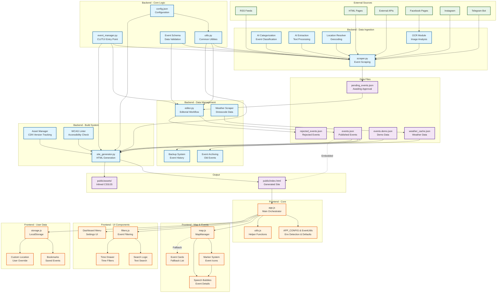
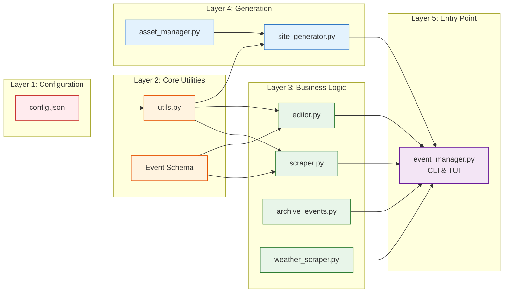
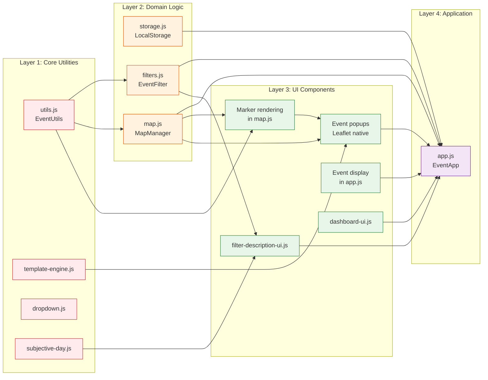
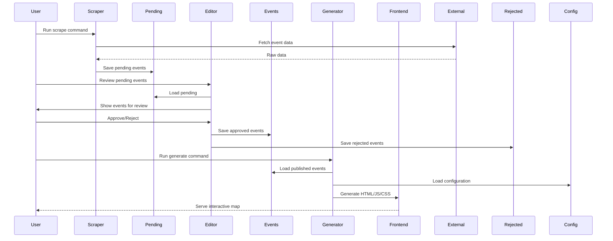
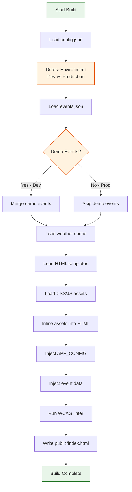
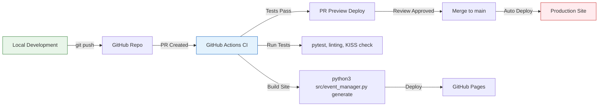

# Architecture Overview

This document provides a high-level overview of the KRWL HOF architecture, including module dependencies, data flow, and system design.

## Table of Contents

1. [System Overview](#system-overview)
2. [Module Dependency Diagram](#module-dependency-diagram)
3. [Data Flow](#data-flow)
4. [Key Architectural Decisions](#key-architectural-decisions)

## System Overview

KRWL HOF is a **mobile-first Progressive Web App (PWA)** for discovering community events with interactive map visualization.

**Technology Stack:**
- **Backend**: Python 3.x with modular design
- **Frontend**: Vanilla JavaScript + Leaflet.js
- **Build**: Static site generation
- **Deployment**: GitHub Pages / Netlify / Vercel

**Architecture Philosophy:**
- **KISS Principle**: Keep it simple, avoid over-engineering
- **Progressive Enhancement**: Works without JavaScript, better with it
- **Mobile First**: Optimized for mobile devices
- **Modular Design**: Clear separation of concerns

## Module Dependency Diagram

### Complete System Architecture



### Backend Module Dependency Detail



### Frontend Module Dependency Detail



## Data Flow

### Event Lifecycle



### Build Process



## Key Architectural Decisions

See [Architectural Decision Records (ADRs)](./adr/README.md) for detailed rationale:

1. **[ADR-001: Fallback List When Map Fails](./adr/001-fallback-list-when-map-fails.md)**
   - Progressive enhancement strategy
   - Resilience against CDN failures
   - Accessibility considerations

2. **[ADR-002: Vanilla JS Over Frameworks](./adr/002-vanilla-js-over-frameworks.md)**
   - KISS principle for frontend
   - No React/Vue/Angular dependency
   - Small bundle size, fast loading

3. **[ADR-003: Single Entry Point](./adr/003-single-entry-point.md)**
   - Unified CLI/TUI in event_manager.py
   - No src/main.py confusion
   - Consistent initialization

## Critical Dependencies

### Backend Critical Path

```
config.json → utils.py → (scraper.py, editor.py) → event_manager.py
```

**If you change:**
- `config.json` → Test ALL modules (entire app affected)
- `utils.py` → Test scraper, editor, site_generator (most backend affected)
- `event_manager.py` → Test CLI commands and TUI (entry point)

### Frontend Critical Path

```
utils.js → (map.js, filters.js) → app.js
```

**If you change:**
- `app.js` → Test entire frontend (main orchestrator)
- `map.js` → Test marker display, speech bubbles (map visualization)
- `filters.js` → Test event filtering, search (event visibility)

## Performance Considerations

### Bundle Size Targets

- **Total JS**: < 50KB (currently ~40KB)
- **Total CSS**: < 30KB (currently ~25KB)
- **Leaflet.js**: ~40KB (external, cacheable)
- **Total Page Weight**: < 150KB (excluding images)

### Loading Performance

- **First Contentful Paint**: < 1.5s target
- **Time to Interactive**: < 5s target
- **Page Load**: < 3s target

### Optimization Strategies

- Inline all CSS/JS (no external requests except CDN)
- Minify CSS/JS in production builds
- Compress images (SVG preferred)
- Lazy load event data (load on scroll for large lists)
- Cache events in localStorage
- Prefetch weather data

## Security Considerations

### Backend

- ✅ Input validation on all scraped data
- ✅ Schema validation (Pydantic models)
- ✅ No secrets in config files (use environment variables)
- ✅ Editorial workflow prevents malicious event injection

### Frontend

- ✅ XSS protection via proper escaping
- ✅ Content Security Policy headers
- ✅ HTTPS only (enforced by hosting)
- ✅ LocalStorage data sanitization

## Testing Strategy

### Backend Tests

- **Unit Tests**: Individual module functions
- **Integration Tests**: End-to-end workflows (scrape → approve → generate)
- **Schema Tests**: Event data validation
- **KISS Tests**: Architecture compliance

### Frontend Tests

- **Manual Testing**: Browser DevTools, mobile emulation
- **Accessibility Testing**: WCAG AA compliance, screen readers
- **Cross-Browser Testing**: Chrome, Firefox, Safari
- **Performance Testing**: Lighthouse scores

### Test Commands

```bash
# Backend tests
python3 tests/test_scraper.py --verbose
python3 tests/test_event_schema.py --verbose
python3 src/modules/kiss_checker.py --verbose

# Feature verification
python3 src/modules/feature_verifier.py --verbose

# Filter tests
python3 src/modules/filter_tester.py --verbose

# Config validation (CRITICAL before commits)
python3 scripts/validate_config.py
```

## Deployment Architecture



## References

- **Feature Registry**: [features.json](../features.json) - Complete feature list with dependencies
- **Dependency Maps**: [DEPENDENCIES.md](../DEPENDENCIES.md) - Detailed module relationships
- **Project Guidelines**: [.github/copilot-instructions.md](../.github/copilot-instructions.md) - Coding standards
- **ADRs**: [docs/adr/](./adr/) - Architectural decisions with rationale

## Contributing

When making architectural changes:

1. **Check dependencies first**: Use `python3 src/modules/dependency_checker.py --check-feature FEATURE_ID`
2. **Document decisions**: Create ADR if making significant architectural choice
3. **Update diagrams**: Keep this document in sync with code
4. **Run tests**: Verify no breaking changes
5. **Update features.json**: Add/update feature entries with dependencies
